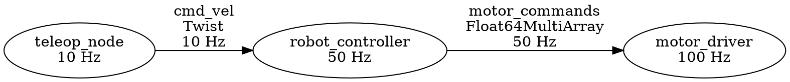

# HORUS Node Graph Visualization

A feature for visualizing the computational graph of HORUS nodes and their topic-based communication within IDE environments.

## Overview

The Node Graph provides visual representation of the HORUS system architecture:

- **Node Visualization**: Display all nodes in the system as graph nodes
- **Topic Connections**: Show publisher-subscriber relationships as edges
- **Live Updates**: Real-time visualization of active communication
- **Interactive Navigation**: Click nodes to jump to code
- **Performance Metrics**: Visualize message rates, CPU usage, and bandwidth

## Visual Representation

### Graph Elements

**Nodes**:
```
┌─────────────────────┐
│  robot_controller   │
│                     │
│  50 Hz              │
│  8.5% CPU           │
└─────────────────────┘
```

**Topics (Edges)**:
```
robot_controller ──cmd_vel (10 Hz)──> motor_driver
                  geometry_msgs::Twist
```

**Complete Graph Example**:
```
┌─────────────┐                           ┌──────────────┐
│ teleop_node │                           │ camera_driver│
│  10 Hz      │                           │  30 Hz       │
└──────┬──────┘                           └──────┬───────┘
       │                                         │
       │ cmd_vel                   camera/image_raw
       │ (Twist, 10 Hz)             (Image, 30 Hz)
       ▼                                         ▼
┌─────────────────┐                    ┌──────────────────┐
│robot_controller │                    │ image_processor  │
│  50 Hz          │                    │  30 Hz           │
└────────┬────────┘                    └──────────────────┘
         │
         │ motor_commands
         │ (Float64MultiArray, 50 Hz)
         ▼
┌─────────────────┐
│  motor_driver   │
│  100 Hz         │
└─────────────────┘
```

---

## IDE-Specific Implementations

### VSCode Implementation

**WebView Panel**:

Uses D3.js or Cytoscape.js for interactive graph visualization:

```typescript
// Create webview panel
const panel = vscode.window.createWebviewPanel(
    'horusNodeGraph',
    'HORUS Node Graph',
    vscode.ViewColumn.Two,
    {
        enableScripts: true,
        retainContextWhenHidden: true
    }
);

// Get graph data from language server
const graphData = await client.sendRequest('horus/graphData', {
    includeInactive: false,
    includeTypes: true
});

// Render graph
panel.webview.html = getGraphHtml(graphData);
```

**Features**:
- Drag to reposition nodes
- Zoom and pan
- Click node to jump to code
- Hover for detailed info
- Auto-layout algorithms (force-directed, hierarchical, circular)
- Filter by node type or topic
- Export to SVG/PNG

**Color Coding**:
- Green: Running nodes
- Gray: Stopped nodes
- Red: Error state
- Blue: Selected node
- Yellow: High CPU usage (>50%)

### IntelliJ Implementation

**Tool Window with JGraphX**:

```kotlin
class NodeGraphToolWindow : ToolWindowFactory {
    override fun createToolWindowContent(project: Project, toolWindow: ToolWindow) {
        val graph = mxGraph()
        val component = mxGraphComponent(graph)

        // Render HORUS node graph
        renderGraph(graph, getGraphData())

        toolWindow.contentManager.addContent(
            toolWindow.contentManager.factory.createContent(component, "", false)
        )
    }
}
```

**Features**:
- Native Swing integration
- Export to various formats
- Print support
- Minimap navigation

### Vim/Neovim Implementation

**ASCII Art Visualization**:

```
                 teleop_node
                      |
                      | cmd_vel
                      v
              robot_controller
                      |
                      | motor_commands
                      v
                 motor_driver


camera_driver ──camera/image_raw──> image_processor
```

**Terminal UI (with Terminal Graphics)**:

Uses libraries like `tui-rs` for more sophisticated terminal visualization:

```
┌─ Node Graph ─────────────────────────────────────────────────────┐
│                                                                   │
│       ┌─────────────┐                                             │
│       │ teleop_node │                                             │
│       └──────┬──────┘                                             │
│              │ cmd_vel                                            │
│              ▼                                                     │
│       ┌─────────────────┐                                         │
│       │robot_controller │                                         │
│       └────────┬─────────┘                                        │
│                │ motor_commands                                   │
│                ▼                                                   │
│       ┌─────────────────┐                                         │
│       │  motor_driver   │                                         │
│       └─────────────────┘                                         │
│                                                                   │
│  [Navigation: hjkl] [Select: Enter] [Quit: q]                    │
└───────────────────────────────────────────────────────────────────┘
```

**Keybindings**:
- `hjkl`: Navigate between nodes
- `Enter`: Jump to node source code
- `i`: Inspect node details
- `t`: Filter by topic
- `r`: Refresh graph
- `q`: Close graph

### Emacs Implementation

**Graphviz Integration**:

Generate Graphviz DOT format and render with `graphviz-dot-mode`:

```elisp
(defun horus-show-node-graph ()
  "Display HORUS node graph using Graphviz."
  (interactive)
  (let* ((graph-data (horus--get-graph-data))
         (dot-content (horus--generate-dot graph-data)))
    (with-current-buffer (get-buffer-create "*HORUS Node Graph*")
      (erase-buffer)
      (insert dot-content)
      (graphviz-dot-mode)
      (graphviz-dot-preview)
      (display-buffer (current-buffer)))))
```

**Generated DOT**:


---

## Graph Data Structure

### Language Server Response

```typescript
interface GraphData {
    nodes: NodeInfo[];
    topics: TopicGraphInfo[];
    connections: Connection[];
    metadata?: GraphMetadata;
}

interface NodeInfo {
    id: string;                 // Unique node identifier
    name: string;               // Display name
    type: NodeType;             // Node category
    status: NodeStatus;         // Current status
    tickRate: number;           // Execution rate (Hz)
    cpuUsage?: number;          // CPU usage (%)
    memoryUsage?: number;       // Memory usage (bytes)
    position?: Position;        // Saved layout position
    sourceLocation?: Location;  // Jump-to-code location
}

enum NodeType {
    Sensor = "sensor",
    Actuator = "actuator",
    Processing = "processing",
    Control = "control",
    Logging = "logging",
    Visualization = "visualization",
    Unknown = "unknown"
}

enum NodeStatus {
    Running = "running",
    Stopped = "stopped",
    Error = "error",
    Paused = "paused"
}

interface TopicGraphInfo {
    name: string;               // Topic name
    messageType: string;        // Message type
    messageCount?: number;      // Total messages
    messageRate?: number;       // Messages per second
    bandwidth?: number;         // Bytes per second
}

interface Connection {
    id: string;                 // Unique connection ID
    from: string;               // Publisher node ID
    to: string;                 // Subscriber node ID
    topic: string;              // Topic name
    messageType: string;        // Message type
    messageRate?: number;       // Messages per second
    latency?: number;           // Average latency (ms)
    dropRate?: number;          // Message drop rate (%)
}

interface GraphMetadata {
    timestamp: number;          // Graph generation time
    nodeCount: number;          // Total nodes
    topicCount: number;         // Total topics
    connectionCount: number;    // Total connections
    systemLoad?: number;        // Overall system load (%)
}

interface Position {
    x: number;
    y: number;
}

interface Location {
    uri: string;                // File URI
    range: Range;               // Line range
}
```

---

## Graph Layout Algorithms

### Force-Directed Layout

Nodes repel each other, edges act as springs:

```typescript
function forceDirectedLayout(nodes: NodeInfo[], connections: Connection[]) {
    const simulation = d3.forceSimulation(nodes)
        .force("charge", d3.forceManyBody().strength(-1000))
        .force("link", d3.forceLink(connections).distance(100))
        .force("center", d3.forceCenter(width / 2, height / 2))
        .force("collision", d3.forceCollide().radius(50));

    simulation.on("tick", updatePositions);
}
```

**Best for**: General-purpose visualization, exploring connections

### Hierarchical Layout

Organize nodes in layers based on data flow:

```
Layer 0: Sensors (inputs)
    
Layer 1: Processing
    
Layer 2: Control
    
Layer 3: Actuators (outputs)
```

**Best for**: Understanding data pipeline, control flow

### Circular Layout

Arrange nodes in a circle:

```
         sensor1
            |
    sensor2   processing1
       |   ×   |
    actuator1  processing2
            |
        actuator2
```

**Best for**: Small graphs, emphasizing symmetry

### Custom Layout

User can manually position nodes:

```typescript
// Save positions
const positions = nodes.map(n => ({ id: n.id, x: n.x, y: n.y }));
localStorage.setItem('horus_graph_layout', JSON.stringify(positions));

// Restore positions
const savedPositions = JSON.parse(localStorage.getItem('horus_graph_layout'));
nodes.forEach(n => {
    const saved = savedPositions.find(p => p.id === n.id);
    if (saved) {
        n.x = saved.x;
        n.y = saved.y;
    }
});
```

---

## Interactive Features

### Node Selection

**Single Selection**:
- Click node to select
- Highlights node and connected edges
- Shows node details in sidebar
- Enables "Jump to Code" action

**Multi-Selection**:
- Ctrl+Click to select multiple nodes
- Shows aggregate statistics
- Enables batch operations

### Navigation

**Jump to Code**:
```typescript
function onNodeClick(node: NodeInfo) {
    if (node.sourceLocation) {
        vscode.window.showTextDocument(
            vscode.Uri.parse(node.sourceLocation.uri),
            { selection: node.sourceLocation.range }
        );
    }
}
```

**Find References**:
```typescript
function findTopicReferences(topic: string) {
    // Find all publish/subscribe calls for this topic
    vscode.commands.executeCommand('workbench.action.findInFiles', {
        query: `"${topic}"`,
        isRegex: false
    });
}
```

### Filtering

**By Node Type**:
```
[x] Sensors
[x] Processing
[x] Control
[ ] Logging (hidden)
[x] Actuators
```

**By Status**:
```
[x] Running
[ ] Stopped
[ ] Error
```

**By Topic**:
```
Search topics: [cmd_vel______]
               [Show only nodes using "cmd_vel"]
```

### Zoom and Pan

```typescript
const zoom = d3.zoom()
    .scaleExtent([0.1, 10])
    .on("zoom", (event) => {
        svg.attr("transform", event.transform);
    });

svg.call(zoom);
```

**Controls**:
- Mouse wheel: Zoom
- Click + Drag: Pan
- Double-click node: Zoom to fit
- `Ctrl+0`: Reset zoom

---

## Live Updates

### Real-Time Graph Updates

```typescript
// Subscribe to graph updates
await client.sendRequest('horus/subscribeGraphUpdates', {
    interval: 1000  // Update every second
});

// Receive updates
client.onNotification('horus/graphUpdated', (update: GraphUpdate) => {
    // Update node status
    if (update.nodeStatus) {
        updateNodeStatus(update.nodeStatus);
    }

    // Update connection rates
    if (update.connectionRates) {
        updateConnectionRates(update.connectionRates);
    }

    // Animate changes
    animateUpdates();
});
```

### Visual Feedback

**Message Flow Animation**:

Animate particles flowing along edges to show active communication:

```typescript
function animateMessageFlow(connection: Connection) {
    const particle = svg.append("circle")
        .attr("r", 3)
        .attr("fill", "blue")
        .attr("cx", connection.from.x)
        .attr("cy", connection.from.y);

    particle.transition()
        .duration(1000 / connection.messageRate)
        .attr("cx", connection.to.x)
        .attr("cy", connection.to.y)
        .on("end", () => particle.remove());
}
```

**Node Pulsing**:

Pulse nodes when they're actively processing:

```typescript
function pulseNode(nodeId: string) {
    d3.select(`#node-${nodeId}`)
        .transition()
        .duration(500)
        .attr("r", 55)
        .transition()
        .duration(500)
        .attr("r", 50);
}
```

**Edge Thickness**:

Vary edge thickness based on message rate:

```typescript
function updateEdgeThickness(connection: Connection) {
    const thickness = Math.log10(connection.messageRate + 1) * 2;
    d3.select(`#edge-${connection.id}`)
        .attr("stroke-width", thickness);
}
```

---

## Performance Optimization

### Large Graphs

**Level of Detail**:

Simplify rendering when zoomed out:

```typescript
zoom.on("zoom", (event) => {
    const scale = event.transform.k;

    if (scale < 0.5) {
        // Zoomed out: hide labels, simplify nodes
        svg.selectAll(".node-label").style("display", "none");
        svg.selectAll(".node").attr("r", 5);
    } else {
        // Zoomed in: show details
        svg.selectAll(".node-label").style("display", "block");
        svg.selectAll(".node").attr("r", 50);
    }
});
```

**Virtualization**:

Only render visible nodes:

```typescript
function renderVisibleNodes() {
    const viewport = getViewportBounds();
    const visibleNodes = nodes.filter(n => isInViewport(n, viewport));

    // Only render visible nodes
    updateNodeElements(visibleNodes);
}
```

**Throttling**:

Limit update frequency:

```typescript
const throttledUpdate = _.throttle(updateGraph, 100);  // Max 10 Hz

client.onNotification('horus/graphUpdated', throttledUpdate);
```

### Memory Management

**Cleanup**:

```typescript
function disposeGraph() {
    // Unsubscribe from updates
    client.sendRequest('horus/unsubscribeGraphUpdates', {});

    // Clear DOM
    svg.selectAll("*").remove();

    // Clear data
    nodes = [];
    connections = [];
}
```

---

## Export and Sharing

### Export Formats

**SVG**:
```typescript
function exportSVG() {
    const svgData = svg.node().outerHTML;
    const blob = new Blob([svgData], { type: 'image/svg+xml' });
    saveAs(blob, 'horus_graph.svg');
}
```

**PNG**:
```typescript
function exportPNG() {
    const canvas = document.createElement('canvas');
    const ctx = canvas.getContext('2d');
    const svgData = new XMLSerializer().serializeToString(svg.node());
    const img = new Image();

    img.onload = () => {
        canvas.width = img.width;
        canvas.height = img.height;
        ctx.drawImage(img, 0, 0);
        canvas.toBlob(blob => saveAs(blob, 'horus_graph.png'));
    };

    img.src = 'data:image/svg+xml;base64,' + btoa(svgData);
}
```

**DOT (Graphviz)**:
```typescript
function exportDOT() {
    const dot = `digraph horus_graph {
        ${nodes.map(n => `"${n.name}" [label="${n.name}\\n${n.tickRate} Hz"];`).join('\n')}
        ${connections.map(c => `"${c.from}" -> "${c.to}" [label="${c.topic}"];`).join('\n')}
    }`;

    const blob = new Blob([dot], { type: 'text/plain' });
    saveAs(blob, 'horus_graph.dot');
}
```

**JSON**:
```typescript
function exportJSON() {
    const graphData = { nodes, connections, metadata };
    const json = JSON.stringify(graphData, null, 2);
    const blob = new Blob([json], { type: 'application/json' });
    saveAs(blob, 'horus_graph.json');
}
```

---

## Configuration

### VSCode Settings

```json
{
    "horus.nodeGraph.enabled": true,
    "horus.nodeGraph.layout": "force-directed",
    "horus.nodeGraph.autoUpdate": true,
    "horus.nodeGraph.updateInterval": 1000,
    "horus.nodeGraph.showInactive": false,
    "horus.nodeGraph.showMessageFlow": true,
    "horus.nodeGraph.edgeThicknessScale": "logarithmic",
    "horus.nodeGraph.colorByType": true,
    "horus.nodeGraph.saveLayout": true
}
```

---

## Testing

### Unit Tests

```typescript
test('Graph data parsing', () => {
    const data = parseGraphData(mockResponse);

    assert.equal(data.nodes.length, 3);
    assert.equal(data.connections.length, 2);
    assert.equal(data.nodes[0].name, "robot_controller");
});
```

### Integration Tests

```typescript
test('Live graph updates', async () => {
    const graphPanel = new NodeGraphPanel(extensionContext);
    await graphPanel.show();

    // Simulate update
    await client.sendNotification('horus/graphUpdated', {
        nodeStatus: [{ id: "node1", status: "running" }]
    });

    // Verify update
    await waitFor(() => {
        const node = graphPanel.getNode("node1");
        assert.equal(node.status, "running");
    });
});
```

---

## See Also

- [LSP_PROTOCOL.md](./LSP_PROTOCOL.md) - Graph data protocol
- [TOPIC_INSPECTOR.md](./TOPIC_INSPECTOR.md) - Topic inspection
- [Language Server README](../language-server/README.md)
